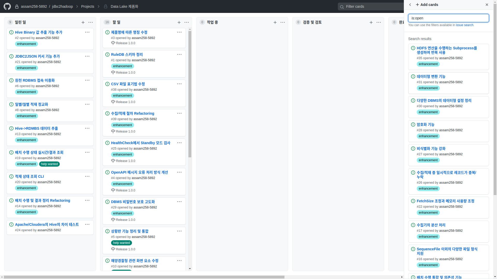

# 해양경찰청 수집 결과

- 소요시간 : 9000 초 (2:30)
- 수집 테이블수 : 3000 개
- 수집 레코드수 : 13억 레코드
- 수집 데이터크기 : 0.5 TB
- 네트워크 전송량 : 1.5 TB (수집+적재+검증)

## 수집 성능

- CPU 1 Core당 7MB/sec 수집 및 10MB/sec 적재
- CPU 8 Core에서 8개 쓰레드로 수집/적재
- CPU 사용량 평균 60% 최대 100%
- Memory 사용량 평균 15GB 최대 25GB
- 디스크 읽기 평균 30MB/sec 최대 725MB/sec
- 디스크 쓰기 평균 46MB/sec 최대 843MB/sec
- 네트워크 읽기 평균 41MB/sec 최대 93MB/sec
- 네트워크 쓰기 평균 22MB/sec 최대 75MB/sec

※ 메모리 증설 혹은 튜닝 후, 쓰레드 수를 CPU Core수의 1.5-2배로 설정할 경우 60-70%(잔여 CPU 및 1GB Nic 한계) 정도 개선 예상

# 개발 환경

- Visual Studio Code (Remote Development)
- Docker (Ubuntu+Python+JAVA+Hadoop+Hive+PostgreSQL+SQLite3)
- GitHub (SourceControl+IssueTracker)

※ Linux 및 Mac OS에서 Docker 없이 개발 가능하며, Windows에서는 Docker Container 상의 Linux에서 개발

# 수집/적재 흐름

## 내부 데이터 수집/적재 흐름

Data Lake의 RDBMS 데이터 수집 절차는 아래와 같다.

|**Step**|**명칭**|**설명**|
|---:|---|---|
|1|메타데이터 수집|수집하고자 하는 RDBMS의 테이블과 컬럼 정보들을 수집하여 RuleDB에 입력한다.(수작업) ※ 추후 메타 수집을 보조할 수 있은 기능을 추가하는 것이 좋을 것 같음.|
|2|설정 파일 생성|RuleDB로 부터 시스템 접속 정보와 테이블, 컬럼 정보를 포함하여 설정 파일을 생성한다.|
|3|배치 수행|배치 수행기는 복수의 시스템의 대상 테이블들을 병렬로 동시에 수집/적재를 진행한다. 원활하고 보다 빠른 처리를 위해 다음의 규칙에 따라 수집한다. - 설정에 따라 정해진 쓰레드 수에 따라 동시에 수집하여 Hadoop 시스템의 부하를 일정 수준으로 유지한다. - 동일 시스템 내에서는 수집/적재에 소요되는 시간이 긴 테이블부터 먼저 수행하여 전체 소요 시간를 최적화 한다. - 시스템 간에는 시스템 내 진행율에 따라 진행이 느린 시스템의 테이블 부터 먼저 수행하여 동일 시스템 내의 부하를 일정하게 유지한다.|
|4|수집/적재|수집/적재기는 JDBC로 원천 RDBMS에 접속하여 테이블의 레코드들을 수집하여 CSV 파일로 기록하면서 Hive(HDFS)에 Sequence File로도 적재한다. 상세한 절차는 아래와 같다. - 테이블이 없다면 테이블을 생성한다. - 오늘 날짜의 파티션이 있다면 해당 파티션을 삭제한다. - 오늘 날짜의 파티션을 생성한다. - 오늘 날짜 파티션의 HDFS Location을 조회한다. - 조회된 HDFS ㅣLocation에 Sequence File을 생성하고 수집된 레코드를 적재한다. ※ 위의 절차는 멱등성이 있어 몇번을 수행하여도 동일한 결과를 얻을 수 있어, 장애 발생 시는 배치를 다시 수행하는 것으로 복구가 가능하다. ※ 처리해야할 수집대상 테이블의 수와 Update나 Delete의 수행이 느린 Hive의 특성상 모든 테이블에 대해서 먼저 전체 레코드 백업 방식으로 접근하고, 레코드 수가 너무 많아 불가피한 경우에 한하여 개별 테이블의 특성에 따라 일자 등에 따라 구분하여 별도의 파티션으로 수집/적재를 수행한다.|
|5|검증|적재가 완료되는 JDBC로 Hive에 접속하여 적재된 레코드를 추출하여 CSV 파일로 기록한다. 수집/적재 시에 기록된 CSV 파일과 추출된 CSV 파일의 MD5 Hash값을 생성한 후 비교하여 적재된 데이터를 검증한다.|
|6|로그|검증이 완료되면 수집/적재된 레코드 수와 검증 결과를 시작/종료 시간등의 정보와 함께 RuleDB에 저장한다. 재수행시에는 이 정보에 따라 수집/적재가 성공한 테이블은 제외하고 수집을 수행한다.|

## 외부 데이터 수집/적재 흐름

|**Step**|**명칭**|**설명**|
|---:|---|---|
|1|메타데이터 수집|수집하고자 하는 OpenAPI의 테이블과 컬럼 정보들을 작성하여 RuleDB에 입력한다.(수작업)|
|2|설정 파일 생성|RuleDB로 부터 시스템 접속 정보와 테이블, 컬럼 정보를 포함하여 설정 파일을 생성한다.|
|3|배치 수행|배치 수행기는 복수의 시스템들을 병렬로 동시에 수집/적재를 진행한다. 원활하고 보다 빠른 처리를 위해 다음의 규칙에 따라 수집한다. - 설정에 따라 정해진 쓰레드 수에 따라 동시에 수집하여 Hadoop 시스템의 부하를 일정 수준으로 유지한다. 소요되는 시간이 긴 시스템부터 먼저 수행하여 전체 소요 시간를 최적화 한다.|
|4|수집/적재|수집/적재기는 직접 혹은 Proxy Server를 경유하여 HTTP로 원천 데이터를 수집하여 Hive(HDFS)에 Sequence File로도 적재한다. 상세한 절차는 아래와 같다. - HTTP로 원천 데이터를 수집한 후 Python의 List 변수에 데이터를 정리하여 추가한다. - CSV 파일을 생성하고 수집된 Python의 List 변수를 CSV 파일에 기록한다. - 테이블이 없다면 테이블을 생성한다. - 오늘 날짜의 파티션이 있다면 해당 파티션을 삭제한다. - 오늘 날짜의 파티션을 생성한다. - 오늘 날짜 파티션의 HDFS Location을 조회한다. - 조회된 HDFS ㅣLocation에 Sequence File을 생성하고 CSV 파일의 레코드들을 적재한다. ※ 위의 절차는 멱등성이 있어 몇번을 수행하여도 동일한 결과를 얻을 수 있어, 장애 발생 시는 배치를 다시 수행하는 것으로 복구가 가능하다. ※ Update나 Delete의 수행이 느린 Hive의 특성상 먼저 전체 레코드 수집 방식으로 접근하고, 레코드 수가 너무 많아 불가피한 경우에 한하여 개별 API의 특성에 따라 일자 등에 따라 구분하여 별도의 파티션으로 수집/적재를 수행한다.|
|5|검증|적재가 완료되는 JDBC로 Hive에 접속하여 적재된 레코드를 추출하여 CSV 파일로 기록한다. 수집/적재 시에 기록된 CSV 파일과 추출된 CSV 파일의 MD5 Hash값을 생성한 후 비교하여 적재된 데이터를 검증한다.|
|6|로그|검증이 완료되면 수집/적재된 레코드 수와 검증 결과를 시작/종료 시간등의 정보와 함께 RuleDB에 저장한다. 재수행시에는 이 정보에 따라 수집/적재가 성공한 테이블은 제외하고 수집을 수행한다.|

※ Python의 List 변수에 데이터를 정리한 이후의 Hive 적재 절차는 내부 데이터 수집과 유사하며, 파일 데이터 수집등에도 동일한 구조를 응용하여 활용할 수 있다.

# Data Lake Architecture

펜타시스템테크놀러지의 Data Lake의 구조은 아래와 같다.

펜타시스템테크놀러지의 Data Lake의 각 Layer는 다음의 기능을 수행한다.

|**Layer**|**설명**|
|---|---|
|Primitive Operation|Java로 JDBC와 Hive, HDFS와 직접 접속하여 기본 기능을 처리한다. 호출을 위해서는 연결 정보와 SQL문등의 보다 구체적인 데이터가 필요하다. 대용량의 Bulk 처리에 있어서는 빠른 처리 속도가 필요한 부분도 있다.|
|Single Action|RuleDB로 부터 생성된 설정 파일의 정보로부터 구체적인 연결 정보와 SQL문 등를 생성하여 Primitive Operation Layer를 호출한다. 기능에 따리서는 빠른 처리를 위해서 다중 쓰레드를 사용한 병렬 처리를 수행하는 부분도 있지만, 단일 기능에 대해서만 병렬 처리를 수행한다.|
|Batch & HealthCheck|배치의 수행 전 이중화된 접속 자원 중 사용 가능한 접속 자원에 대한 Health Check를 수행하여 Batch시 사용할 접속 자원을 선택한다. 수집 대상 테이블 혹은 OpenAPI를 병렬 처리로 수집한다. 각 테이블/OpenAPI별 수행 시에 필요한 Single Action들을 순차적으로 수행한다. 수집 로그는 RuleDB에 Log 테이블에 기록된다.|
|Scheduler|매일 정해진 시간에 HealthCheck와 Batch를 수행한다. 실패한 항목이 있는 경우 HealthCheck와 Batch를 재수행하여 실패한 항목만 다시 수집한다.|
|Dashboard|RuleDB에 저장된 배치 수행 Log 테이블을 조회하여, 수집 현황을 Web으로 표현한다.|

각 Layer별로 제공하는 기능은 아래와 같다.

## Primitive Operation

- JDBC로 SELECT문을 수행 후 결과를 추출하여 SequenceFile로 HDFS에 적재
- JDBC로 SELECT문을 수행 후 결과를 추출하여 CSV 파일로 저장
- JDBC로 SELECT문을 수행 후 결과를 추출하여 JDBC로 DBMS의 테이블에 적재
- CSV 파일을 SequenceFile로 HDFS에 적재
- CSV 파일을 JDBC로 DBMS의 INSERT문으로 적재
- JDBC로 DBMS의 Product와 Version 조회
- JDBC로 DBMS의 Query를 조회하여 결과를 화면에 출력
- JDBC로 DBMS의 Query의 결과 데이터형을 조회
- JSON으로 전달된 Query를 JDBC로 수행하고 결과를 JSON으로 반환
- JAR 파일의 빌드 없이 설정에 JDBC Driver 추가로 새로운 RDBMS를 사용 가능

## Single Action

- RuleDB에서 단일 시스템의 모든 테이블을 정보를 조회하여 설정 파일을 생성
- 단일 CSV 파일을 JDBC로 DBMS의 테이블에 적재
- 단일 CSV 파일을 SequenceFile로 HDFS(Hive)에 적재
- Hive 단일 테이블을 추출하여 CSV 파일로 저장
- Hive 단일 시스템 복수 테이블의 테이블/파티션의 통계 정보를 분석
- Hive 단일 시스템 복수 테이블의 불필요한 파티션을 삭제
- Hive 단일 시스템 복수 테이블의 테이블/파티션의 레코드 건수를 조회
- Hive 단일 시스템 복수 테이블을 생성
- Hive 단일 시스템 복수 테이블의 파티션을 생성
- Hive 단일 시스템 복수 테이블을 제거
- Hive 단일 시스템 복수 테이블의 파티션을 제거
- Hive 단일 시스템 복수 테이블의 파티션 목록을 조회
- Hive 단일 시스템의 쿼리를 수행
- Hive 단일 시스템의 SQL Shell을 수행
- Hive 단일 시스템 복수 테이블의 모든 레코드를 삭제
- Hive 단일 시스템 복수 테이블의 적재 데이터 검증(MD5)
- RDBMS 단일 테이블을 추출하여 CSV 파일로 저장
- RDBMS 단일 테이블을 추출하여 Hive의 테이블/파티션에 적재
- RDBMS 단일 시스템 복수 테이블의 테이블/파티션의 레코드 건수를 조회
- RDBMS 단일 시스템 복수 테이블의 모든 레코드를 삭제
- RDBMS의 단일 테이블을 추출하여 RDBMS의 단일 테이블에 적재
- RDBMS 단일 시스템의 쿼리를 수행
- RDBMS 단일 시스템의 SQL Shell을 수행
- OpenAPI 수집(HTTP) API 제공 및 Python 변수(List)를 Hive 단일 테이블/파티션에 적재
- JDBC 비밀번호 암복호화

## Batch & HealthCheck

- Health Check로 사용 가능한 RuleDB(PostgreSQL), Hive Server, HDFS Name Server, Proxy(Apache2) Server를 선택
- RDBMS에서 Hive로 복수의 시스템의 복수 테이블을 수집/적재
- OpenAPI에서 Hive로 복수의 시스템의 수집/적재
- 수집 결과를 Rule DB의 Log 테이블로 기록

## Scheduler

- 정해진 시간에 Health Check와 Batch 수행
- Batch 수행 실패 시 실패한 시스템/테이블만 Health Check와 Batch 재수행

## Dashboard

- 수집 현황을 Web 화면으로 출력

# 개선 필요 항목

아래 항

- **볼드: 필수 개선 항목**
- 일반: 시간적 여유가 있으면 포함
- ~~볼드: 범위 제외~~

## RDBMS 수집/적재

- **(#1) RuleDB 스키마 정리**
- (#2) Hive Binary 값 추출 기능 추가
- (#6) 원천 RDBMS 접속 이중화
- ~~(#7) 단일 테이블 다중 쓰레드/커넥션 적재~~
- ~~(#9) 실시간 변경 수집/적재~~
- (#21) JDBC2JSON의 커서 기능 추가
- ~~(#22) FetchSize 조정과 메모리 사용량 조정~~
- (#24) Apache/Cloudera의 Hive의 차이 테스트
- **(#25) HealthCheck에서 Standby 모드 검사**
- ~~(#26) 수집/적재 중 일시적으로 레코드가 중복/누락~~
- ~~(#27) 비식별화 기능 강화~~
- ~~(#28) 암호화 기능~~
- **(#29) DBMS 비밀번호 보호 고도화**
- ~~(#30) 다양한 DBMS의 데이터형 설정 정리~~
- ~~(#31) 데이터형 변환 기능~~
- ~~(#35) HDFS 연산을 수행하는 Subprocess를 생성하여 반복 사용~~
- **(#38) CSV 파일 표기법 수정**
- **(#39) 수집/적재 방식 Refactoring**

- (#8) 일별/월별 적재 정교화
- ~~(#11) RDBMS 스키마 수집~~
- ~~(#12) RDBMS 스키마 검증~~
- (#13) Hive->RDBMS 데이터 추출
- (#14) 배치 수행 및 결과 정리 Refactoring
- ~~(#15) 배치 수행 통합 및 의존성 기능~~
- ~~(#16) SequenceFile 이외의 다양한 형식의 적재 방식 추가~~
- ~~(#17) 수집기의 분산 처리~~
- (#20) 적재 상태 조회 CLI

## OpenAPI 수집/적재

- **(#4) OpenAPI 메시지 오류 처리 방식 개선**

## 상황판

- **(#5) 상황판 기능 정리 및 통합**
- **(#10) 해양경찰청 관련 화면 요소 수정**
- (#19) 배치 수행 상태 실시간/결과 조회

## 문서

- **(#18) 수집/적재 개발자 Tutorial**
- **(#23) Crontab 스크립트 Tutorial**
- **(#32) 설계 및 테스트 문서 생성 Tutorial**
- **(#33) Proxy 서버 설정 Tutorial**
- **(#34) 수집/적재 사용자 설명서**
- **(#40) 상황판 개발자 Tutorial**
- **(#41) 상황판 사용자 설명서**
- **(#42) OpenAPI Tutorial**

## 기타

- **(#3) 제품명에 따른 명칭 수정**
- **(#36) Docker 개발용 Image 작성**
- **(#37) Docker 홍보용 Image 작성**

## 이슈 관리

